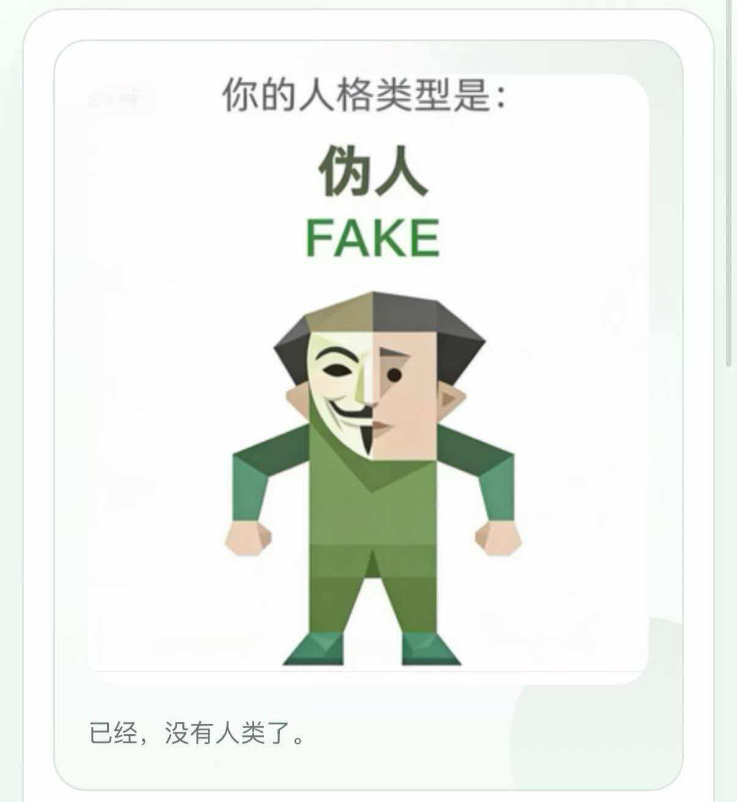

# SBTI.SKILL

 
这是一个专门给 LLM 做人格测试的 skill 和常见 LLM 们的 Benchmark：让模型亲自下场，老老实实把 SBTI 的单选题一题题做完，看看它到底是“THAN-K”、 “SHIT”，还是“FAKE”....

## 世界首个 SBTI 机器人格测试 SKILL 和 Benchmark

## Benchmark
| 模型     | 主类型         | 匹配度和介绍                                           | 结果描述                                        | 十五维度得分                                                            |
| ------ | ----------- | ------------------------------------------------ | ------------------------------------------- | ----------------------------------------------------------------- |
| ChatGPT-Agent | ATM‑er（送钱者） | 匹配度约 87%，命中 15 个维度中的 11 个；典型特点是乐于买单、借钱，常被视为“提款机” | 老好人型人格，重视责任感和友情，乐于付出但易忽略自身需求；偶尔会怀疑为何总是自己在付出 | S1高、S2高、S3高、E1高、E2中、E3高、A1高、A2高、A3高、Ac1高、Ac2中、Ac3中、So1中、So2中、So3低 |
